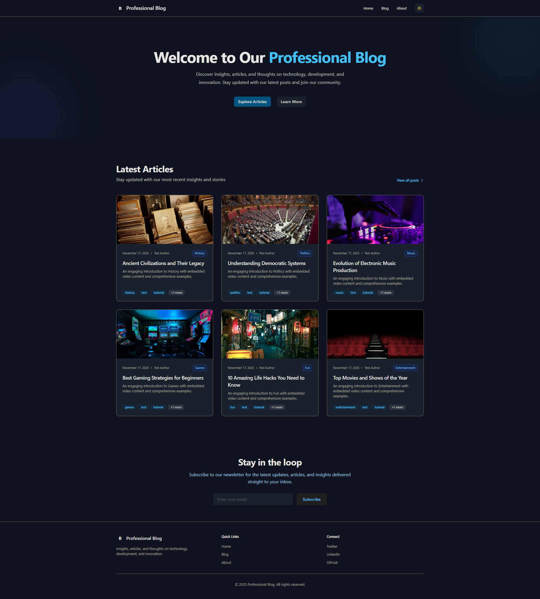

# 🚀 Your Professional Blog - Modern Next.js Blog Starter Template

[](https://nextjs.org/)
[](https://tailwindcss.com/)
[](https://www.typescriptlang.org/)
[](https://turso.tech)
[](https://github.com/AKzar1el/blog-starter-template/blob/main/LICENSE.md)
[](https://github.com/AKzar1el/blog-starter-template/stargazers)

> Launch your professional blog in minutes, not days. A production-ready, SEO-optimized blog platform with rich content support, multimedia embedding, and powerful API.

[🌐 Live Demo](#) | [📖 Full API Docs](API_DOCUMENTATION.md) | [🐛 Report Bug](https://github.com/AKzar1el/blog-starter-template/issues) | [✨ Request Feature](https://github.com/AKzar1el/blog-starter-template/issues)

---

## 📸 Preview


<!-- Replace SCREENSHOT_URL_HERE with your actual screenshot URL -->

<!-- Optional: Add more screenshots


-->

---

## 💡 Why This Template?

Building a professional blog from scratch takes weeks of development time. **Your Professional Blog** gives you everything you need to start publishing content immediately:

- ✅ **Production-ready in 5 minutes** - Clone, install, and start writing
- ✅ **SEO optimized out of the box** - Rank higher on Google from day one
- ✅ **No configuration required** - Sensible defaults that just work
- ✅ **Professional design** - Clean, modern UI with smooth animations
- ✅ **Powerful API** - Programmatic content creation for automation
- ✅ **Free for personal use** - Start your blog journey today

Perfect for **developers**, **startups**, **indie hackers**, **content creators**, and anyone who wants a **modern, fast, SEO-friendly blog** without the complexity.

---

## ✨ Features

### 🎯 Core Functionality
- **Modern Tech Stack** - Next.js 14+ with App Router, TypeScript, Tailwind CSS
- **Rich Content Support** - Full Markdown and HTML support with syntax highlighting
- **13 Blog Categories** - Organized content (Technology, Business, Education, Entertainment, etc.)
- **Turso Database** - Serverless SQLite database, perfect for edge deployment
- **Mobile-First Design** - Responsive and beautiful on all devices
- **Lightning Fast** - Server-side rendering, image optimization, code splitting

### 🎬 Media & Content
- **Video Embedding** - YouTube, Vimeo, and direct video files (.mp4, .webm, .ogg)
- **Audio Support** - Embed podcasts and audio files (.mp3, .wav, .ogg, .m4a)
- **Flexible Layouts** - Position media inline, left, right, or full-width
- **Image Optimization** - Automatic image compression and lazy loading
- **Table of Contents** - Auto-generated from post headings
- **Code Highlighting** - Beautiful syntax highlighting for technical posts

### 🔍 SEO & Performance
- **SEO-Optimized** - Dynamic meta tags, Open Graph, Twitter Cards
- **JSON-LD Structured Data** - Rich search results with article schema
- **Automatic Sitemap** - Generated sitemap.xml for search engines
- **Robots.txt** - Proper search engine indexing configuration
- **90+ Lighthouse Score** - Optimized for Core Web Vitals
- **Clean URLs** - SEO-friendly slugs and canonical URLs

### 🚀 Developer Experience
- **Powerful REST API** - Create posts programmatically with secure authentication
- **TypeScript** - Full type safety and excellent IDE support
- **Hot Reload** - Instant preview of changes during development
- **Comprehensive Validation** - Input validation for all API endpoints
- **Well-Documented** - Clear code, comments, and extensive API documentation
- **Easy Customization** - Modular components and Tailwind CSS

### 📊 Analytics & Engagement
- **View Counter** - Track post popularity
- **Reading Time** - Automatic reading time estimates
- **Social Sharing** - Built-in Twitter, LinkedIn, and link sharing
- **Tag System** - Organize and filter posts by tags
- **Category Navigation** - Filter posts by category with one click
- **Comment System** - Threaded comments with nested replies, likes, and real-time engagement

### 🎨 UI/UX
- **Smooth Animations** - Fade-in and slide effects for professional feel
- **Dark/Light Compatible** - Ready for dark mode implementation
- **Professional Shadows** - Depth and hierarchy with subtle shadows
- **Responsive Tables** - Mobile-optimized data display
- **Accessible** - Semantic HTML and ARIA attributes

---

## 🚀 Quick Start

Get your blog running in **4 simple steps**:

### 1️⃣ Clone the repository

```bash
git clone https://github.com/AKzar1el/blog-starter-template.git
cd blog-starter-template
```

### 2️⃣ Set up Turso Database

**Create a free Turso account:**
1. Go to [https://turso.tech](https://turso.tech)
2. Sign up with GitHub (it's free!)
3. Click **"Create Database"**
4. Name it `blog-db` and click **Create**

**Get your credentials:**
- Copy the **Database URL** (looks like `libsql://blog-db-xxxxx.turso.io`)
- Click **"Create Token"** and copy the auth token

**Initialize the database schema:**
1. In Turso dashboard, click your database
2. Open the **SQL Shell** or **Console**
3. Paste and run this SQL:

```sql
CREATE TABLE posts (
  id INTEGER PRIMARY KEY AUTOINCREMENT,
  slug TEXT UNIQUE NOT NULL,
  title TEXT NOT NULL,
  content TEXT NOT NULL,
  excerpt TEXT NOT NULL,
  author TEXT NOT NULL,
  tags TEXT NOT NULL,
  coverImage TEXT,
  category TEXT DEFAULT 'All Blog Posts',
  publishedAt TEXT NOT NULL,
  updatedAt TEXT NOT NULL,
  views INTEGER DEFAULT 0,
  embeddedMedia TEXT
);

CREATE INDEX idx_posts_slug ON posts(slug);
CREATE INDEX idx_posts_publishedAt ON posts(publishedAt DESC);
CREATE INDEX idx_posts_category ON posts(category);
```

### 3️⃣ Install dependencies and configure

```bash
# Install packages
npm install

# Set up environment variables
cp .env.example .env.local
```

**Edit `.env.local` file with your Turso credentials:**
```env
# Database Configuration (from Turso dashboard)
TURSO_DATABASE_URL=libsql://your-database-name.turso.io
TURSO_AUTH_TOKEN=your-turso-auth-token-here

# API Configuration
API_KEY=your-secure-api-key-here

# Site Configuration
NEXT_PUBLIC_SITE_URL=http://localhost:3000
NEXT_PUBLIC_SITE_NAME=Your Professional Blog
```

### 4️⃣ Start the development server

```bash
npm run dev
```

🎉 **That's it!** Open [http://localhost:3000](http://localhost:3000) and start blogging!

---

## 📝 Creating Your First Post

### Using the API (Recommended)

```bash
curl -X POST http://localhost:3000/api/posts \
  -H "Content-Type: application/json" \
  -H "x-api-key: YOUR_API_KEY" \
  -d '{
    "title": "My First Blog Post",
    "content": "# Welcome\n\nThis is my first post!",
    "excerpt": "An introduction to my new blog",
    "author": "Your Name",
    "tags": ["welcome", "introduction"],
    "category": "Technology",
    "coverImage": "https://images.unsplash.com/photo-1499750310107-5fef28a66643"
  }'
```

**For detailed API documentation with all features**, see [API_DOCUMENTATION.md](API_DOCUMENTATION.md).

---

## ⚙️ Configuration

### Site Settings

**`next.config.js`** - Configure Next.js settings:
```javascript
module.exports = {
  images: {
    domains: ['images.unsplash.com', 'your-image-domain.com'],
  },
}
```

**`.env.local`** - Environment variables:
```env
# Required - Database Configuration (Turso)
TURSO_DATABASE_URL=libsql://your-database.turso.io
TURSO_AUTH_TOKEN=your-turso-auth-token

# Required - API Configuration
API_KEY=your-secure-random-api-key

# Required - Site Configuration
NEXT_PUBLIC_SITE_URL=https://yourdomain.com
NEXT_PUBLIC_SITE_NAME=Your Blog Name

# Optional - Analytics Integration
NEXT_PUBLIC_GA_ID=G-XXXXXXXXXX                 # Google Analytics 4 ID
NEXT_PUBLIC_PLAUSIBLE_DOMAIN=yourdomain.com    # Plausible Analytics Domain
```

### Customization

**Colors & Styling:**
- Edit `tailwind.config.ts` for theme colors
- Modify `app/globals.css` for custom styles and animations
- Update components in `components/` folder

**Content Categories:**
- Edit `lib/constants.ts` to modify or add categories
- Default categories: Technology, Business, Education, Ethics, Art, Entertainment, Fun, Games, Music, Politics, History, News

**Database:**
- Turso (serverless SQLite) - Perfect for production and edge deployment
- SQLite-compatible syntax - Easy to work with
- Schema defined in `lib/db/index.ts`
- Initialization script available: `npm run init-db`

---

## 📁 Project Structure

```
blog-starter-template/
├── app/
│   ├── api/
│   │   └── posts/
│   │       └── route.ts              # REST API with validation
│   ├── blog/
│   │   ├── [slug]/
│   │   │   └── page.tsx              # Individual post page
│   │   └── page.tsx                  # Blog listing with categories
│   ├── about/
│   │   └── page.tsx                  # About page
│   ├── layout.tsx                    # Root layout with SEO
│   ├── page.tsx                      # Homepage
│   ├── sitemap.ts                    # Dynamic sitemap
│   ├── robots.ts                     # Robots.txt
│   └── globals.css                   # Global styles
├── components/
│   ├── Header.tsx                    # Navigation
│   ├── Footer.tsx                    # Site footer
│   ├── PostCard.tsx                  # Post preview card
│   ├── MarkdownContent.tsx           # Markdown/HTML renderer
│   ├── MediaEmbed.tsx                # Video/audio embedding
│   ├── TableOfContents.tsx           # Auto-generated TOC
│   └── ShareButtons.tsx              # Social sharing
├── lib/
│   ├── db/
│   │   ├── index.ts                  # Database setup (Turso client)
│   │   └── posts.ts                  # Post operations
│   ├── constants.ts                  # Blog categories & config
│   ├── media-utils.ts                # Media processing
│   └── utils.ts                      # Helper functions
├── scripts/
│   └── init-db.ts                    # Database initialization script
├── public/                           # Static assets
├── .env.example                      # Environment template
├── API_DOCUMENTATION.md              # Full API docs
├── DATABASE_MIGRATION.md             # Database setup guide
└── package.json
```

---

## 🎬 Rich Media Support

Embed videos and audio with flexible layouts:

### YouTube Videos
```json
{
  "embeddedMedia": [
    {
      "url": "https://www.youtube.com/watch?v=VIDEO_ID",
      "type": "youtube",
      "position": "right",
      "caption": "Tutorial: Getting Started"
    }
  ]
}
```

### Vimeo Videos
```json
{
  "url": "https://vimeo.com/VIDEO_ID",
  "type": "vimeo",
  "position": "full-width"
}
```

### Direct Video Files
```json
{
  "url": "https://example.com/video.mp4",
  "type": "video",
  "position": "inline"
}
```

### Audio Files (Podcasts, Music)
```json
{
  "url": "https://example.com/podcast.mp3",
  "type": "audio",
  "position": "inline",
  "caption": "Episode 1: Introduction"
}
```

**Position Options:**
- `inline` - Centered within content (default)
- `right` - Media on right, text wraps left (desktop only)
- `left` - Media on left, text wraps right (desktop only)
- `full-width` - Spans full width for cinematic effect

---

## 📖 API Documentation

### Create a Post

**Endpoint**: `POST /api/posts`

**Headers**:
```
Content-Type: application/json
x-api-key: YOUR_API_KEY
```

**Required Fields**:
- `title` (string) - Post title
- `content` (string) - Markdown or HTML content
- `excerpt` (string) - Brief summary
- `author` (string) - Author name
- `tags` (array) - Minimum 1 tag

**Optional Fields**:
- `category` (string) - One of 13 available categories
- `slug` (string) - Custom URL (auto-generated if not provided)
- `coverImage` (string) - Cover image URL
- `embeddedMedia` (array) - Video/audio embeds

**Example Request**:
```bash
curl -X POST http://localhost:3000/api/posts \
  -H "Content-Type: application/json" \
  -H "x-api-key: YOUR_API_KEY" \
  -d '{
    "title": "Getting Started with Next.js",
    "content": "# Introduction\n\nNext.js is amazing...",
    "excerpt": "Learn Next.js fundamentals",
    "author": "John Doe",
    "tags": ["nextjs", "react", "tutorial"],
    "category": "Technology",
    "coverImage": "https://images.unsplash.com/photo-1461749280684-dccba630e2f6"
  }'
```

**Success Response** (201):
```json
{
  "success": true,
  "message": "Post created successfully",
  "post": {
    "id": 1,
    "slug": "getting-started-with-nextjs",
    "title": "Getting Started with Next.js",
    "publishedAt": "2024-11-17T10:30:00.000Z",
    ...
  }
}
```

### Get All Posts

**Endpoint**: `GET /api/posts`

**Query Parameters**:
- `limit` (number) - Posts per page
- `offset` (number) - Pagination offset

**Example**:
```bash
curl http://localhost:3000/api/posts?limit=10&offset=0
```

**📚 For comprehensive API documentation**, see [API_DOCUMENTATION.md](API_DOCUMENTATION.md)

---

## 🌐 Deployment

Deploy your blog to production with one click:

### Vercel (Recommended - Free Tier Available)

[](https://vercel.com/new/clone?repository-url=https://github.com/AKzar1el/blog-starter-template)

**Steps:**
1. **Set up Turso Database** (see [Quick Start](#-quick-start) above)
2. Click the deploy button above
3. Connect your GitHub account
4. Set environment variables (for Production, Preview, and Development):
   - `TURSO_DATABASE_URL` - Your Turso database URL
   - `TURSO_AUTH_TOKEN` - Your Turso auth token
   - `API_KEY` - Choose a secure API key
   - `NEXT_PUBLIC_SITE_URL` - Your Vercel deployment URL
   - `NEXT_PUBLIC_SITE_NAME` - Your blog name
5. Deploy! 🎉

**Important:** Make sure your Turso database is initialized with the schema (see Quick Start step 2️⃣) before deploying.

### Netlify

[](https://app.netlify.com/start/deploy?repository=https://github.com/AKzar1el/blog-starter-template)

### Other Platforms

This standard Next.js app can deploy to:
- **Railway** - [Deploy Guide](https://docs.railway.app/guides/nextjs)
- **Render** - [Deploy Guide](https://render.com/docs/deploy-nextjs)
- **DigitalOcean App Platform** - [Deploy Guide](https://www.digitalocean.com/community/tutorials/how-to-deploy-a-next-js-app-to-app-platform)
- **AWS Amplify** - [Deploy Guide](https://docs.amplify.aws/guides/hosting/nextjs/q/platform/js/)

**💡 Production Tip**: Turso is production-ready and serverless, perfect for edge deployment. The free tier includes everything you need to get started!

---

## 🛠️ Built With

### Core Technologies
- **[Next.js 14+](https://nextjs.org/)** - React framework with App Router
- **[React 18+](https://reactjs.org/)** - UI library
- **[TypeScript](https://www.typescriptlang.org/)** - Type safety
- **[Tailwind CSS](https://tailwindcss.com/)** - Utility-first CSS

### Content & Data
- **[Turso (@libsql/client)](https://turso.tech/)** - Serverless SQLite database
- **[react-markdown](https://github.com/remarkjs/react-markdown)** - Markdown renderer
- **[rehype-highlight](https://github.com/rehypejs/rehype-highlight)** - Code syntax highlighting

### SEO & Performance
- **[Next/Image](https://nextjs.org/docs/api-reference/next/image)** - Automatic image optimization
- **[Next/Font](https://nextjs.org/docs/basic-features/font-optimization)** - Font optimization
- **JSON-LD** - Structured data for search engines

---

## 📊 Database Schema

### Posts Table

| Column | Type | Description |
|--------|------|-------------|
| `id` | INTEGER | Primary key, auto-increment |
| `slug` | TEXT | Unique URL slug (indexed) |
| `title` | TEXT | Post title |
| `content` | TEXT | Markdown or HTML content |
| `excerpt` | TEXT | Brief summary for SEO |
| `author` | TEXT | Author name |
| `tags` | TEXT | JSON array of tags |
| `category` | TEXT | Blog category (indexed) |
| `coverImage` | TEXT | Cover image URL (nullable) |
| `embeddedMedia` | TEXT | JSON array of media objects (nullable) |
| `publishedAt` | TEXT | ISO 8601 timestamp (indexed) |
| `updatedAt` | TEXT | ISO 8601 timestamp |
| `views` | INTEGER | View counter (default: 0) |

**Indexes for Performance:**
- `idx_posts_slug` - Fast slug lookups
- `idx_posts_publishedAt` - Efficient sorting by date
- `idx_posts_category` - Quick category filtering

---

## 🎯 Performance & SEO

### Lighthouse Scores
- **Performance**: 90+
- **Accessibility**: 95+
- **Best Practices**: 95+
- **SEO**: 100

### SEO Features Included
- ✅ Dynamic meta tags for every page
- ✅ Open Graph tags for social sharing
- ✅ Twitter Card support
- ✅ JSON-LD structured data (Article schema)
- ✅ Automatic sitemap.xml generation
- ✅ Robots.txt configuration
- ✅ Semantic HTML5 structure
- ✅ Canonical URLs
- ✅ Mobile-friendly design
- ✅ Fast page load times

### Performance Optimizations
- ✅ Server-side rendering (SSR)
- ✅ Automatic code splitting
- ✅ Image lazy loading and optimization
- ✅ Font optimization
- ✅ Efficient caching strategies
- ✅ Minimal JavaScript bundle

---

## 🔒 Security

Your blog is secure by default:

- **API Authentication** - Secure API key for post creation
- **Input Validation** - Comprehensive validation on all inputs
- **SQL Injection Protection** - Parameterized queries
- **XSS Protection** - React escaping + DOMPurify for HTML
- **External Link Security** - Automatic `rel="noopener noreferrer"`
- **CSRF Protection** - Built-in Next.js CSRF protection
- **Type Safety** - TypeScript prevents common errors

---

## 📖 Documentation

- **[API Documentation](API_DOCUMENTATION.md)** - Complete API reference with examples
- **[Database Migration Guide](DATABASE_MIGRATION.md)** - Turso setup and migration instructions
- **Installation Guide** - See [Quick Start](#-quick-start) above
- **Configuration** - See [Configuration](#️-configuration) above
- **Deployment Guide** - See [Deployment](#-deployment) above

### Database (Turso)

This blog uses **Turso** - a serverless SQLite database perfect for modern web applications:

**Why Turso?**
- ✅ **Serverless** - No infrastructure to manage
- ✅ **SQLite-compatible** - Familiar SQL syntax
- ✅ **Edge-ready** - Deploy close to your users
- ✅ **Free tier** - Generous limits for most blogs
- ✅ **Fast** - Sub-10ms query latency
- ✅ **Scalable** - Grows with your blog

**Key Features:**
- Automatic backups and point-in-time recovery
- Built-in replication for high availability
- Web dashboard for easy management
- CLI tools for advanced operations

For detailed setup instructions, see the [Quick Start](#-quick-start) guide above.

---

## 🗺️ Roadmap

### Current Features ✅
- [x] Production-ready blog platform
- [x] SEO optimization
- [x] Rich content support (Markdown & HTML)
- [x] Media embedding (video & audio)
- [x] 13 blog categories
- [x] REST API with authentication
- [x] Mobile-responsive design
- [x] View counter and analytics
- [x] Dark mode support
- [x] Related posts recommendations
- [x] Threaded comment system with likes and nested replies

### Planned Features 🚧
- [ ] Search functionality
- [ ] Newsletter integration (Mailchimp, ConvertKit)
- [ ] Multi-author support with profiles
- [ ] RSS feed
- [ ] Admin dashboard
- [ ] Draft posts management
- [ ] Scheduled publishing

See [open issues](https://github.com/AKzar1el/blog-starter-template/issues) for feature requests and bug reports.

---

## 🤝 Contributing

Contributions make the open-source community amazing! Any contributions you make are **greatly appreciated**.

### How to Contribute

1. **Fork** the repository
2. **Create** a feature branch
   ```bash
   git checkout -b feature/AmazingFeature
   ```
3. **Commit** your changes
   ```bash
   git commit -m 'Add some AmazingFeature'
   ```
4. **Push** to the branch
   ```bash
   git push origin feature/AmazingFeature
   ```
5. **Open** a Pull Request

### Contribution Guidelines
- Write clear, descriptive commit messages
- Follow the existing code style (TypeScript, ESLint)
- Add comments for complex logic
- Update documentation if needed
- Test your changes thoroughly

---

## 📄 License

This project is available under **dual licensing**:

### ✅ Personal & Educational Use (Free)

**Free to use** under the [MIT License](LICENSE) for:
- Personal blogs and portfolios
- Educational projects and learning
- Non-profit organizations
- Open-source projects
- Hobby projects

### 💼 Commercial Use

For commercial use, please **contact me** for licensing options.

**Commercial use includes:**
- Building blogs for clients (paid work)
- Using in products or services that generate revenue
- Integrating into SaaS platforms
- Selling as a premium template

**Why dual licensing?**  
I want this template to be freely available for personal use and learning while ensuring sustainable development through commercial licensing.

📧 **Contact for commercial license:** [tomi.seregi99@gmail.com](mailto:tomi.seregi99@gmail.com)

**Questions about licensing?** Email me - I'm happy to help you determine which license fits your use case!

---

## 💬 Support & Community

Need help? Have questions? Want to share what you built?

- 📧 **Email**: [tomi.seregi99@gmail.com](mailto:tomi.seregi99@gmail.com)
- 🐛 **Bug Reports**: [GitHub Issues](https://github.com/AKzar1el/blog-starter-template/issues)
- 💡 **Feature Requests**: [GitHub Issues](https://github.com/AKzar1el/blog-starter-template/issues)
- 💬 **Discussions**: [GitHub Discussions](https://github.com/AKzar1el/blog-starter-template/discussions)

**Response Time**: I aim to respond to issues and questions within 48 hours.

---

## 🌟 Show Your Support

If this project helped you launch your blog, please consider:

- ⭐ **Starring** this repository
- 🍴 **Forking** and contributing
- 📢 **Sharing** with others who might find it useful
- 💬 **Tweeting** about your experience
- ☕ **[Buy me a coffee](https://buymeacoffee.com/akzar1el)** *(optional)*

Every star motivates me to keep improving this project! 🚀

---

## 🙏 Acknowledgments

Built with ❤️ using amazing open-source tools:
- [Next.js](https://nextjs.org/) team for the incredible framework
- [Vercel](https://vercel.com/) for seamless deployment
- [Tailwind CSS](https://tailwindcss.com/) for beautiful styling
- The open-source community for inspiration and support

---

## 📈 Stats


---

## 🔗 Links

- **Repository**: [https://github.com/AKzar1el/blog-starter-template](https://github.com/AKzar1el/blog-starter-template)
- **Live Demo**: *Coming soon*
- **Author**: [AKzar1el](https://github.com/AKzar1el)

---

## 📝 What's New

### Version 2.1 (November 2024)

**🚀 Database Migration to Turso**
- Migrated from SQLite to Turso (serverless SQLite)
- Perfect compatibility with Vercel and edge deployment
- Sub-10ms query latency
- Built-in backups and replication
- Easy setup with web dashboard
- Production-ready from day one

### Version 2.0 (November 2024)

**🎬 Rich Media Features**
- YouTube and Vimeo video embedding
- Direct video file support (.mp4, .webm, .ogg)
- Audio embedding (.mp3, .wav, .ogg, .m4a)
- Flexible positioning (inline, left, right, full-width)
- Optional captions for embedded content

**📂 Content Organization**
- 13 organized blog categories
- Category navigation with tabs
- Category badges on post cards
- Efficient category-based filtering

**✨ Enhanced Content**
- Full HTML support alongside Markdown
- SEO-optimized link handling
- Automatic external link attributes
- Improved code syntax highlighting

**🎨 UI/UX Improvements**
- Smooth fade-in animations
- Enhanced button interactions
- Professional shadow transitions
- Responsive media layouts
- Better mobile experience

For detailed API usage with new features, see [API_DOCUMENTATION.md](API_DOCUMENTATION.md).

---

<div align="center">

**Made with ❤️ for developers and content creators**

**Launch your blog today. Start writing tomorrow.**

---

*If you find this starter template helpful, please consider leaving a ⭐ to support the project!*

[⬆ Back to Top](#-your-professional-blog---modern-nextjs-blog-starter-template)

</div>
